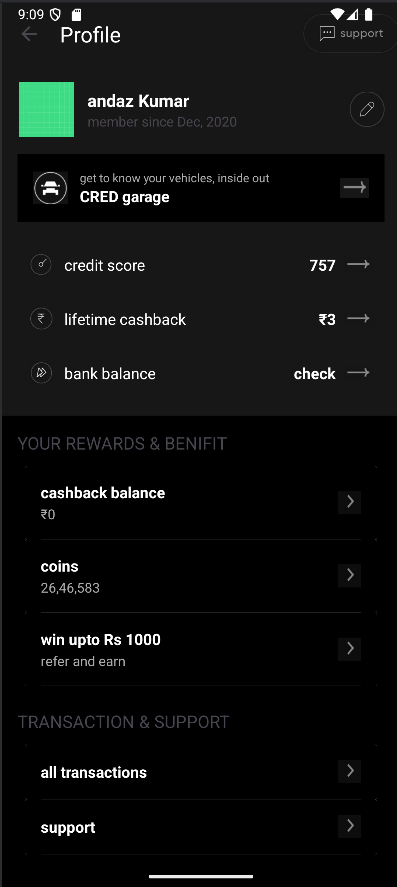

# 📱 Profile Activity - Internship Assignment

This repository contains the implementation of a **Profile Activity UI** created for the Android Internship Assignment.

The UI is designed to resemble the attached reference image `assignment_android.jpg` and includes structured sections, a clean layout, and click interactions.

---

## 🛠️ Tech Stack

- **Language:** Java
- **Platform:** Android
- **IDE:** Android Studio
- **UI Components Used:**  
  - ConstraintLayout  
  - RecyclerView  
  - CardView  
  - ImageView  
  - TextView  
  - Toast

---

## ✨ Features

- Modern Profile screen UI
- CRED-style section layout using RecyclerView
- Interactive components with Toast messages on click
- Fully responsive design

---

## 📸 Screenshots

| Profile UI |
|------------|
|  |

---

## 📂 Project Structure

